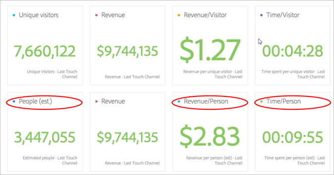
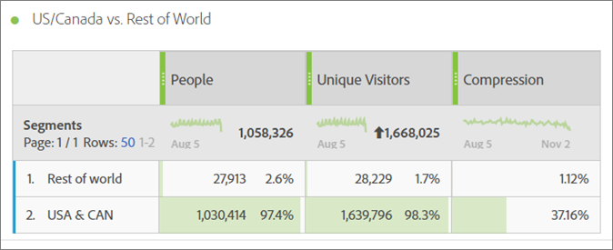
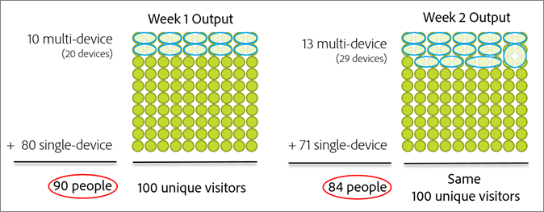
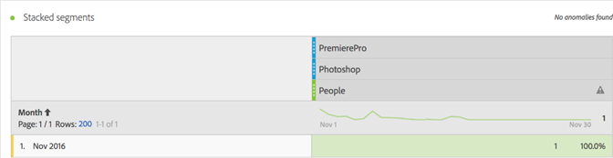
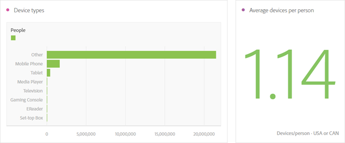
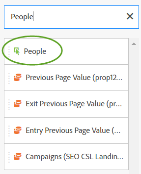

# Mesure Personnes.{#people-metric}

La mesure Personnes indique le nombre de personnes (ou de groupes de périphériques) établi par Adobe Device Graph. Elle vous sera utile dans Analysis Workspace afin d’identifier les visiteurs quel que soit le périphérique qu’ils utilisent.

## People Metric Prerequisites and Considerations {#section-34551d0435fb4b3cb3fad736b7961541}

<table id="table_120F7EF50042485391E58B22DD00A2A8"> 
 <thead> 
  <tr> 
   <th colname="col1" class="entry"> Condition préalable ou considération </th> 
   <th colname="col2" class="entry"> Description </th> 
  </tr>
 </thead>
 <tbody> 
  <tr> 
   <td colname="col1"> 
Device Co-op 
 </td> 
   <td colname="col2"> 
 To use the People metric, become a member of the <a href="http://landing.adobe.com/en/na/events/summit/275658-summit-co-op.html" format="html" scope="external"> Adobe Experience Cloud Device Co-op</a>. La coopération identifie les périphériques multiples d’une personne (ou Experience Cloud ID). D’après ces informations, Analytics déduit de manière statistique le nombre de personnes qui interagissent avec une marque. La mesure est précise à 5 % environ. 
 
<b>Zones géographiques</b> : Device Co-op n’est encore accessible qu’aux États-Unis et au Canada. Par conséquent, lorsque vous évaluez la mesure Personnes, pensez à appliquer un segment à votre analyse pour filtrer vos données pour les États-Unis et le Canada uniquement. 
 
Chaque semaine, Device Graph calcule une nouvelle version de la coopérative et la publie à des fins d’utilisation. Chaque mardi, le système collecte les données les plus récentes et publie une version mise à jour du graphique. Les solutions Experience Cloud utilisent ensuite la dernière version du graphique. Pour Analytics, les modifications sont lues le mercredi et le traitement des modifications prend généralement entre 1 et 2 jours ouvrés. 
 
 
Important :  Lorsque le graphique est mis à jour chaque semaine, il peut avoir un impact historique sur la mesure Personnes. En d’autres termes, le nombre de personnes historiques peut changer au fil du temps lorsque le graphique est appris et mis à jour. Si, par exemple, vous exécutez un rapport aujourd’hui qui comptabilise les personnes le mois dernier, puis le même rapport dans une semaine après la mise à jour du graphique, le nombre de personnes historiques peut légèrement changer. 
 
 </td> 
  </tr> 
  <tr> 
   <td colname="col1"> Autorisations de mesure </td> 
   <td colname="col2"> 
Vous ne pouvez utiliser la mesure Personnes que si vous y avez accès. Les administrateurs peuvent<a href="https://marketing.adobe.com/resources/help/en_US/reference/groups-metrics.html" format="html" scope="external"> personnaliser les autorisations</a> de mesures dans les Outils d’administration. 
 </td> 
  </tr> 
  <tr> 
   <td colname="col1"> Mappage à l’organisation IMS </td> 
   <td colname="col2"> 
La mesure Personnes sera activée pour toutes les suites de rapports <a href="https://marketing.adobe.com/resources/help/en_US/mcloud/map-report-suite.html" format="html" scope="external"> mappées à un IMSORG</a>. 
 </td> 
  </tr> 
  <tr> 
   <td colname="col1"> 
Projets et outils d’analyse 
 </td> 
   <td colname="col2"> 
Vous pouvez utiliser la mesure Personnes dans Analysis Workspace, les analyses ad hoc et le créateur de rapports, ainsi qu’au moyen de l’API, partout où vous utiliseriez la mesure Visiteurs uniques, y compris dans les mesures calculées. 
 
Créez par exemple une mesure de recettes par personne pour remplacer une mesure de recettes par visiteur unique. 
 
Un <a href="https://marketing.adobe.com/resources/help/en_US/analytics/analysis-workspace/starter_projects.html" format="html" scope="external">modèle de projet axé sur les Personnes</a> vous est proposé pour commencer à utiliser la mesure Personnes dans Analysis Workspace. 
 </td> 
  </tr> 
  <tr> 
   <td colname="col1"> 
Activation des règles de robot 
 </td> 
   <td colname="col2"> 
Adobe vous conseille d’activer les <a href="https://marketing.adobe.com/resources/help/en_US/reference/bot_rules.html" format="html" scope="external">règles de robot</a>, en particulier lorsque vous utilisez la mesure Personnes. 
 
Lorsqu’un robot parcourt votre site web, il gonfle artificiellement le nombre de visiteurs uniques recensés. La suppression du trafic des robots de votre suite de rapports vous permet d’obtenir une mesure plus précise de l’activité enregistrée sur vos propriétés numériques, en termes de visiteurs uniques et de personnes. 
 
Pour ce faire, sélectionnez Analytics &gt; Administration &gt; Report Suites. Sélectionnez la suite de rapports concernée, puis sélectionnez Modifier les paramètres &gt; Général &gt; Règles de robots. 
 </td> 
  </tr> 
  <tr> 
   <td colname="col1"> 
Commentaires concernant la segmentation 
 </td> 
   <td colname="col2"> 
 Lorsque vous utilisez des segments avec la mesure Personnes, les résultats des rapports générés peuvent être considérablement inférieurs à vos attentes. 
 
Référez-vous aussi au chapitre <a href="../other-solutions/people.md#section-d03525420dbe48379fd95b230ef05885" format="dita" scope="local">Utilisation de la mesure Personnes avec les segments</a>. 
 </td> 
  </tr> 
 </tbody> 
</table>

## Qu’est-ce que la mesure Personnes ?{#section-89e2b8f5e80f480391449fc8d1117a6a}

La mesure Personnes est une mesure des rapports Analytics permettant d’attribuer des périphériques aux personnes. Elle offre une approche marketing orientée sur les personnes et vous permet ainsi de mesurer l’activité des visiteurs sur tous leurs périphériques. Elle peut être envisagée comme la déduplication de la mesure Visiteurs uniques et désormais totalement la substituer.

**Les périphériques sont des personnes**

Avant que la mesure Personnes ne soit disponible, une personne pouvait consulter votre site et répondre à une campagne ou interagir avec une marque sur trois périphériques différents pour ensuite effectuer un achat et ce, en l’espace de quelques minutes seulement. Selon votre mise en œuvre, Analytics pouvait signaler chaque périphérique comme un visiteur unique et, pour un achat de 30 €, attribuer 10 € aux trois périphériques.

En revanche, grâce à la mesure Personnes, vous attribuez cet achat de 30 € à une seule et même personne :

**Des rapports plus précis**

La mesure Personnes permet de considérer plusieurs périphériques comme une seule et même entité. Le projet Analysis Workspace suivant illustre ce gain de précision en comparant les mesures Visiteurs uniques et Personnes :

Confrontation des mesures Personnes et Visiteurs uniques :

**Définitions**

<table id="table_F8171AF15DA64607B427E3739EF004D6"> 
 <thead> 
  <tr> 
   <th colname="col1" class="entry"> Élément </th> 
   <th colname="col2" class="entry"> Description </th> 
  </tr>
 </thead>
 <tbody> 
  <tr> 
   <td colname="col1"> 
Personnes 
 </td> 
   <td colname="col2"> 
La mesure Personnes part du principe que les clients interagissent avec votre marque sur plusieurs périphériques. Plus vous détaillez ou segmentez vos données, moins il est probable qu’une même personne ayant utilisé plusieurs périphériques soit incluse dans cette tranche de données. 
 </td> 
  </tr> 
  <tr> 
   <td colname="col1"> 
Visiteurs uniques 
 </td> 
   <td colname="col2"> 
Par exemple, plus vous segmentez vos données par date ou heure, plus les résultats des mesures Personnes et Visiteurs uniques se ressembleront. Si vous souhaitez une bonne compréhension de l’impact global de Device Co-op, Adobe conseille d’utiliser une plage de dates des 90 derniers jours. 
 </td> 
  </tr> 
  <tr> 
   <td colname="col1"> 
Compression 
 </td> 
   <td colname="col2"> 
A partir d’une mesure calculée simple, vous constatez que le pourcentage obtenu par la mesure Personnes est très inférieur à celui fourni par la mesure Visiteurs uniques. Cliquez sur l’icône d’information en regard de Compression dans le tableau ci-dessus pour voir comment créer cette mesure. 
 
La mesure Personnes peut substituer la mesure Visiteurs uniques dans d’autres mesures calculées. 
 </td> 
  </tr> 
 </tbody> 
</table>

## Comment la mesure Personnes est-elle calculée ? {#section-0dfb762867e14a7f927796ef3c50592b}

<!--

Analytics uses the HyperLogLog statistical algorithm to calculate People. This means that the smaller the data set, the margin for error may increase. No more than 5% of the numbers should be off by more than 5% 

-->

L’image ci-dessous présente la méthode de calcul de la mesure Personnes et illustre la diminution des résultats obtenus pour la même période de temps passée.

Supposons dans cet exemple qu’il existe un groupe défini de visiteurs. Si vous exécutez un rapport pour une période délimitée du passé, un groupe défini de visiteurs s’affiche. Si Device Graph génère les données présentées dans le graphique de gauche pour la semaine 1, il identifie 90 personnes. Une semaine plus tard, une nouvelle exécution de Device Graph prend en compte de nouvelles informations. Si vous exécutez le même rapport que celui que vous aviez exécuté la semaine précédente, le nombre de personnes n’est plus que de 84. La base de calcul a changé car Device Graph a fourni de nouvelles informations au sujet des périphériques qui doivent être groupés.

## Utilisation de la mesure Personnes avec les segments {#section-d03525420dbe48379fd95b230ef05885}

Lorsque vous utilisez des segments avec la mesure Personnes, les résultats des rapports générés peuvent être considérablement inférieurs à vos attentes. La raison est simple : la segmentation n’utilise pas le conteneur *`person`* container. mais le conteneur Visiteurs, conteneur au plus haut niveau dans la définition, et ce dernier dépend du périphérique et non de la personne.

Ce problème survient principalement lors de l’empilement de segments avec la mesure Personnes.

L’empilement des segments crée un nouveau segment, qui représente la combinaison de tous les segments empilés. Les segments sont empilés quand vous :

* placez un segment sur un autre segment dans Analysis Workspace (ils sont automatiquement associés avec l’opérateur *`And`*) ;
* Apply a single segment that contains the *`And`* operator.
* appliquez un segment aussi bien au niveau du projet que du tableau ; 
* utilisez une suite de rapports virtuelle avec un autre segment.

Par exemple, supposons que vous empiliez les segments suivants sur la mesure Personnes :

* `Campaign = Spring Promotion`
* `Site Section = Product Overview`

Only the number of people who qualify in both segments *`using a single device`* are counted. La mesure Personnes n’affiche pas le nombre de personnes admissibles à l’échelle de plusieurs périphériques.

En outre, l’utilisation de l’opérateur *`Or`* n’est pas conseillée dans ce cas. En effet, le résultat inclurait le nombre de personnes qui remplissent l’un des deux critères, sans aucune possibilité de déterminer combien de personnes remplissent les deux critères à la fois.

Pour en savoir plus, reportez-vous au chapitre [Création de segments](https://marketing.adobe.com/resources/help/en_US/analytics/segment/seg_build.html) dans l’aide concernant la segmentation.

## Types de périphérique {#section-8ab378c84ff34574b9c20fecb3848a86}

Device Co-op et la mesure Personnes fonctionnent mieux dans Adobe Analytics si votre suite de rapports comporte des données issues de plusieurs types de périphérique. Par exemple, si vous combinez dans la même suite de rapports les données provenant du web et d’applications, la mesure Personnes est beaucoup plus efficace et précise. Plus vos données impliquent de périphériques différents, plus il est probable que plusieurs visiteurs uniques seront regroupés en une seule et même personne.

## Experience Cloud ID Service Coverage {#section-bbf0098cac2e467289e7a644a1dea05c}

Device Co-op exige que vos propriétés numériques soient instrumentées à l’aide du service Experience Cloud ID (MCID). L’efficacité de Device Co-op et de la mesure Personnes sera amoindrie si les données de votre suite de rapports comportent un nombre important de visiteurs sans identifiant MCID. 

<!--
mcdc-people-metric-apply.xml
-->

In Analysis Workspace, create a [project](https://marketing.adobe.com/resources/help/en_US/analytics/analysis-workspace/t_freeform_project.html), then drag the **[!UICONTROL People]** metric to the project table:

