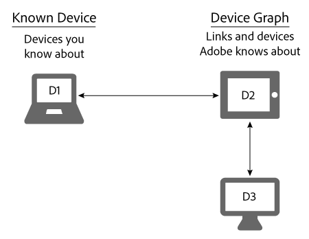

# Périphériques connus{#known-devices}

A propos des périphériques connus dans le graphique de périphériques.

Dans le graphique de périphériques, nous avons le concept d&#39;un *`known device`* graphique. Un périphérique connu est un périphérique utilisé par un client pour interagir avec votre marque.

>[!NOTE]
>
>Dans le [!DNL Adobe Experience Cloud Device Co-op], termes tels que *`device`*, *`person`*, *`identity`* etc. ont des significations précises. Par exemple, &quot;périphérique&quot; peut faire référence au matériel physique tel qu’un téléphone ou une tablette et aux applications qui s’exécutent sur ce matériel. Voir le [glossaire](../glossary.md#glossgroup-0f47d7fbd76c4759801f565f341a386c) pour les définitions.

## Prise en charge des objectifs avec le périphérique connu {#section-80deae33660e4280ac65c659ceff5601}

Le concept d&#39;appareil connu soutient quelques objectifs essentiels à la création et à la maintenance d&#39;un [!DNL Device Co-op] programme efficace. Un périphérique connu est celui qu’un [!DNL Device Co-op] membre connaît à partir d’une interaction avec un consommateur (par exemple, une visite sur le site ou en utilisant une application mobile). Sur la base de ces actions, le [!DNL Device Graph] lien lie les périphériques connus d&#39;un [!DNL Device Co-op] membre aux périphériques fournis par d&#39;autres [!DNL Device Co-op] membres. Ces liens peuvent être [déterministes ou probabilistes](../processes/links.md#concept-58bb7ab25f904f5f98d645e35205c931). Cela profite aux [!DNL Device Co-op] membres parce qu&#39;ils reçoivent :

* Plus de données sur leurs appareils connus.
* Nouvelles informations sur les autres périphériques liés.

Le n&#39; [!DNL Device Graph] fournira pas d&#39;informations sur les clusters de dispositifs qu&#39;un membre Device Co-op n&#39;a pas vu.

## Objectifs de Device Co-op {#section-75aea5a102d54733aae2a7c6ee9ec6c7}

Trois objectifs principaux animent le [!DNL Device Co-op]projet. Ces cas comprennent notamment :

* **Échelle :** Partagez le nombre maximum de liens possibles dans divers cas d’utilisation.
* **Équité :** Veiller à ce que chaque membre des [!DNL Device Co-op] prestations d&#39;une manière proportionnelle à ses cotisations.

* **Confiance des consommateurs :** Maintenir et renforcer la confiance des consommateurs en s&#39;assurant que l&#39;expérience des consommateurs sur plusieurs périphériques implique des marques qu&#39;ils connaissent déjà et qu&#39;ils ont confiance.

## Échelle et périphérique connu {#section-67f734109762457ca62ec306284ea082}

Les méthodes suivantes constituent les méthodes les plus courantes pour qualifier un périphérique comme un périphérique connu. Compte tenu de ces méthodes, [!DNL Device Co-op] les membres auront presque toujours au moins un appareil connu. Ceci soutient l&#39;objectif de fournir une échelle maximale à tous les membres du [!DNL Device Co-op]groupe.

**Organique**

* De la visite d’un client sur votre site ou en utilisant votre application. Il s’agit d’une qualification à partir de données propriétaires.
* En faisant appel à des clients d’un système de gestion de la relation client.

**Marketplace**

* Acheter des données de segment à partir d’une Audience Marketplace.
* d’acheter des données auprès d’un fournisseur de données tiers.

**Publicité**

En remportant l’inventaire lors d’une enchère et en diffusant une publicité sur un périphérique. Le périphérique devient un périphérique connu si cette publicité contient un [!DNL Audience Manager] pixel.

## Périphériques connus et cas d’utilisation équitable {#section-0543188729d845d6b95db70b8b25e9f8}

Les membres du [!DNL Device Co-op] groupe obtiennent des liens proportionnels à leur contribution au [!DNL Device Graph]groupe. Les sociétés qui contribuent à de nombreux périphériques reçoivent plus de liens que les membres qui ne contribuent que peu. [!DNL Device Graph] Nous pensons que cela contribue à rendre l&#39; [!DNL Device Co-op] équité pour tous ses membres. Examinons comment cela fonctionne avec les cas d&#39;utilisation importante et réduite décrits ci-dessous.

**Marque A : grand cas d&#39;utilisation**

Dans cet exemple, la marque A comporte 100 visiteurs de site chaque mois et début une nouvelle campagne de marque sur plusieurs périphériques. Pour simplifier, supposons que le [!DNL Device Graph] connait tous les visiteurs à la marque A sont liés à 1 périphérique supplémentaire. Cela signifie que la marque A pourrait atteindre 100 autres appareils. En outre, le [!DNL Device Graph] contient environ 200 périphériques reliés entre eux.

<table id="table_78C38DC522F94BC38C1DB73740C058AC"> 
 <thead> 
  <tr> 
   <th colname="col1" class="entry"> Périphériques/mois connus </th> 
   <th colname="col2" class="entry"> Périphériques liés reçus de Device Co-op </th> 
   <th colname="col3" class="entry"> Nombre total de périphériques pour Campaign </th> 
  </tr>
 </thead>
 <tbody> 
  <tr> 
   <td colname="col1"> 
100 
 </td> 
   <td colname="col2"> 
100 
 </td> 
   <td colname="col3"> 
200 
 </td> 
  </tr> 
 </tbody> 
</table>

**Marque B : Petit cas d&#39;utilisation**

Dans cet exemple, la marque B comporte 100 visiteurs de site chaque mois et début une nouvelle campagne de marque sur plusieurs périphériques. Pour la simplicité, supposons que le [!DNL Device Graph] sait que tous les visiteurs à la marque B sont liés à 50 périphériques supplémentaires. Cela signifie que la marque B peut atteindre 150 appareils. En outre, le [!DNL Device Graph] contient environ 1000 périphériques reliés entre eux.

<table id="table_A6C9CCF9C6564A89BA7060E075A8E73C"> 
 <thead> 
  <tr> 
   <th colname="col1" class="entry"> Périphériques/mois connus </th> 
   <th colname="col2" class="entry"> Périphériques liés reçus de Device Co-op </th> 
   <th colname="col3" class="entry"> Nombre total de périphériques pour Campaign </th> 
  </tr>
 </thead>
 <tbody> 
  <tr> 
   <td colname="col1"> 
100 
 </td> 
   <td colname="col2"> 
50 
 </td> 
   <td colname="col3"> 
150 
 </td> 
  </tr> 
 </tbody> 
</table>

>[!MORELIKETHIS]
>
>* [Périphériques inconnus](../processes/unknown-device.md#concept-95090d341cdc4c22ba4319d79d8f6e40)

