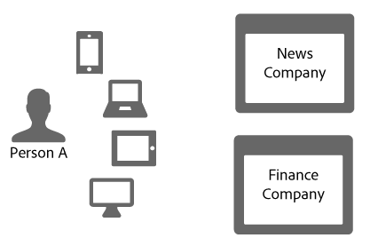
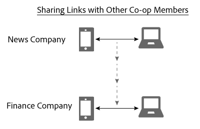

# Partage de liens dans Device Graph{#link-sharing-in-the-device-graph}

Partage de liens dans Device Graph.

Le [!DNL Device Graph] partage des liens déterministes et probabilistes avec différents membres de Adobe Experience Cloud Device Co-op. Le partage de liens est ce qui fait que la variable [!DNL Device Co-op] tellement puissant. Il étend ce que chaque membre sait des appareils associés à une personne anonyme, mais seulement si vous avez déjà vu au moins un des appareils de cette personne anonyme.

## Résumé du graphique de périphérique {#section-7858e9f61b5644c981ffb53626fcc19d}

Avant de commencer, prenons quelques instants pour examiner la manière dont la variable [!DNL Device Graph] fonctionne. Les membres de [!DNL Device Co-op] envoyer des données à la variable [!DNL Device Graph]. Le [!DNL Device Graph] utilise ces données pour construire l’identité d’une personne à partir de [liens déterministes et probabilistes](../processes/links.md#concept-58bb7ab25f904f5f98d645e35205c931) entre les appareils. Comme [!DNL Device Co-op] participant, ces liens fournissent des informations sur la relation entre vos utilisateurs authentifiés, d’autres utilisateurs et leurs appareils. Voyons comment cela fonctionne dans la section ci-dessous.

## Exemple de partage de lien {#section-cb410d827cf14f76bc9b0bd4d31ed767}

L’exemple suivant illustre la puissance du partage de liens dans Device Co-op. Dans cet exemple, nous avons deux sociétés fictives, la société News et la société Finance. Les deux sociétés sont membres du groupe [!DNL Device Co-op]. La personne A est un consommateur qui se connecte ou navigue sur les sites web de chaque entreprise à partir de plusieurs périphériques.

Comme la personne A s’est authentifiée sur le site d’actualités à l’aide de son téléphone mobile et de sa tablette, la société d’actualités l’identifie avec un identifiant de consommateur. Il envoie cet identifiant à la variable [!DNL Device Graph] comme hachage cryptographique. La société Finance a déjà vu ces périphériques, mais la personne A ne s’est pas connectée au site. Par conséquent, la société Finance ne sait pas si ces périphériques sont liés les uns aux autres ni comment ils sont associés à la personne A, ni comment ils le sont.

Compte tenu du hachage cryptographique de l’ID de consommateur, la variable [!DNL Device Graph] reconnaît que ces périphériques sont liés les uns aux autres et à une personne particulière. Pour les entreprises qui ne participent pas au [!DNL Device Co-op] ces visites sur le site semblent provenir d’appareils distincts et aléatoires. Dans tous les cas, une fois que la variable [!DNL Device Graph] contient l’identifiant haché :

* Sait que les téléphones mobiles et les ordinateurs portables sont liés.
* Reconnaît que la société Finance souhaite savoir si le téléphone mobile et l’ordinateur portable sont liés.

Compte tenu de ces conditions, [!DNL Device Graph] partage désormais le lien reliant ces périphériques pour la société d’actualités à la société Finance. Au cours de ce processus, la variable [!DNL Device Graph] duplique et partage le lien d’un membre de co-op à un autre.

À ce stade, la variable [!DNL Device Graph] a rempli son rôle avec succès. La société d&#39;information et la société financière ont toutes deux une image claire d&#39;une identité. Ils peuvent atteindre la personne A avec précision sur tous leurs appareils.

## Confidentialité et partage de liens {#section-7b566018b3304420a4b3e4c079826110}

Maintien de la confidentialité et de l’intégrité des données des consommateurs pour [!DNL Device Co-op] les membres sont essentiels tout au long du processus de partage de liens. Au cours de ce processus d’identification et de partage de liens client, la variable [!DNL Device Graph] n’a pas :

* Dites à la société financière que le lien provient de la société d&#39;actualités.
* Partage de l’ID de client utilisé par une seule [!DNL Device Co-op] membre avec un autre.
* Indiquez toute information autre que le fait que l’appareil mobile et l’ordinateur portable partagent un lien en commun.

## Étapes suivantes {#section-ac6e61f1eb6e45b1bb4be8ece39147c7}

La lecture de la documentation sur l’identité, la liaison et le partage de liens devrait vous donner une bonne idée de la façon dont la variable [!DNL Device Graph] assemble les données en interne. Nous vous recommandons de passer à l’étape suivante en consultant notre documentation qui décrit la manière dont le concept d’ *`known device`* fournit des liens entre appareils aux membres de Device Co-op. Voir [Périphériques connus](../processes/known-device.md#concept-8e87c276819a48bfac5cef10b45216d1) et [Périphériques inconnus](../processes/unknown-device.md#concept-95090d341cdc4c22ba4319d79d8f6e40).
