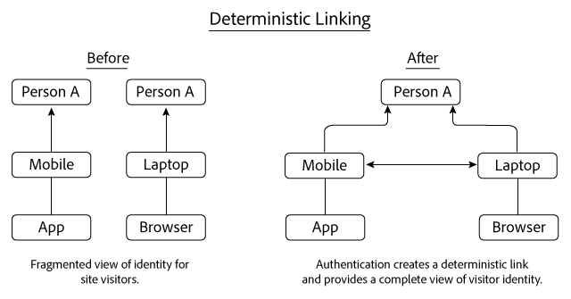
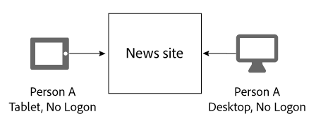
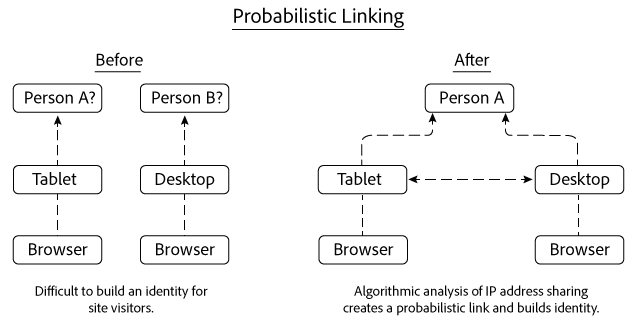
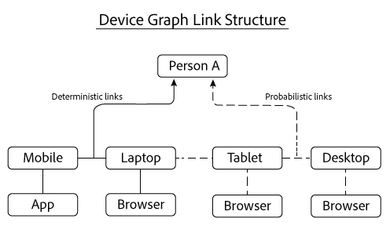

# Liens déterministes et probabilistes{#deterministic-and-probabilistic-links}

Comment le graphique de périphériques analyse les données déterministes et probabilistes pour créer une carte qui relie les périphériques ensemble.

Dans le [!DNL Device Graph]cas présent, les processus internes créent une hiérarchie d&#39;identité qui mappe les périphériques et les connecte à des personnes anonymes individuelles. La sortie du graphique comprend des liens entre périphériques que vous pouvez utiliser pour le ciblage, ainsi que des données exposées dans certaines solutions Experience Cloud. Les solutions d’Adobe qui fonctionnent avec [!DNL Device Graph] les données incluent Analytics, Audience Manager, Media Optimizer et Cible.

L&#39; [!DNL Device Graph] analyse les données déterministes et probabilistes pour créer une carte qui relie les périphériques. Les données déterministes relient les périphériques en fonction des informations de connexion hachées. Les données probabilistes relient les périphériques en fonction d’informations telles que les adresses IP et d’autres métadonnées. Ces connexions permettent aux spécialistes du marketing numérique d’atteindre des personnes plutôt que des appareils. [!DNL Device Graph] Dans le [!DNL Device Graph]cas, le propriétaire d&#39;un appareil est la représentation anonyme d&#39;une personne réelle. Les liens déterministes et probabilistes aident à construire une structure d&#39;identité utilisateur.

>[!NOTE]
>
>Dans Adobe Experience Cloud Device Co-op, les termes tels que *périphérique*, *personne* et *identité* ont des significations spécifiques. Par exemple, *le périphérique* peut faire référence au matériel physique tel qu’un téléphone ou une tablette et aux applications qui s’exécutent sur ce matériel. Voir le [glossaire](../glossary.md#glossgroup-0f47d7fbd76c4759801f565f341a386c) pour les définitions.

## Que sont les liens ? {#section-2df4c6f01eba49369993146df0661f13}

Quand nous parlons de liens, il est important de garder à l&#39;esprit ce qu&#39;ils sont réellement dans le contexte du graphique de [!DNL Experience Cloud] périphériques. Dans ce contexte, les liens ne sont pas des connexions physiques entre les périphériques. Au lieu de cela, un lien est la façon dont le graphique de périphériques associe différents périphériques à une même personne inconnue. Par exemple, supposons que nous ayons un téléphone mobile et un navigateur de bureau. Le téléphone et le navigateur peuvent être considérés comme &quot;liés&quot; une fois que le graphique de périphériques a déterminé que ces deux périphériques sont utilisés par la même personne inconnue. Comme vous le verrez ci-dessous, le graphique de périphériques crée des identités avec des liens déterministes et probabilistes. Et, dans le graphique de périphériques, le propriétaire d&#39;un appareil est la représentation anonyme d&#39;une personne réelle.

## Liens déterministes {#section-33d41e828a674b398e36fe63da20ac09}

Les liens déterministes associent un périphérique à une personne en fonction d’un événement d’authentification (par exemple, une action de connexion à un site à partir d’un périphérique). Cette action crée un identifiant anonymisé appelé ID de consommateur. Regardons comment fonctionne la liaison déterministe. Dans cet exemple, la personne A se connecte à un site de nouvelles par le biais d’une application sur son périphérique mobile. Plus tard ce jour-là, la Personne A se reconnecte, mais cette fois par le biais d&#39;un navigateur sur son ordinateur portable.

En fonction des informations d&#39;ouverture de session, le graphique de périphériques :

* Sait que la personne A s’est authentifiée sur le site de nouvelles avec une combinaison téléphone/application mobile et ordinateur portable/navigateur.
* Associe ces appareils à la personne A.
* Créera une identité basée sur des périphériques liés associés à une personne anonyme.

>[!NOTE]
>
>Ni l’un [!DNL Adobe Experience Cloud Device Co-op] ni l’autre ne [!DNL Device Graph] reçoivent d’informations d’authentification réelles ou d’informations d’identification personnelle dans ces données. Les membres du [!DNL Experience Cloud Device Co-op]graphique de périphériques transmettent des identifiants consommateurs uniques avec hachage cryptographique au graphique de périphériques. L’ID de consommateur représente un utilisateur authentifié dans le graphique et protège la confidentialité des clients.

## Liens probabilistes {#section-5f5aa755da984f9d851f7cb380262998}

Les liens probabilistes connectent un périphérique à une personne de manière algorithmique, en fonction de caractéristiques et de métadonnées telles que :

* Comportement de navigation
* Adresses IP
* Systèmes d’exploitation
* Identifiants IDFA et GAID

Regardons comment fonctionne la liaison probabiliste. Dans cet exemple, la personne A navigue vers un site d’actualités sur sa tablette, puis plus tard depuis un ordinateur de bureau. Lors de la navigation, la personne A ne se connecte pas au site d&#39;actualités. Lors de chaque visite distincte, la tablette et le bureau partagent la même adresse IP.

À partir de ces informations, le [!DNL Device Graph] évalue les schémas de partage d&#39;adresses IP entre les deux périphériques et les relie si les résultats suggèrent qu&#39;ils appartiennent à la personne A. Le résultat final est la hiérarchie de l&#39;identité dérivée des calculs de probabilité algorithmique.

Dans cet exemple, le graphique de périphériques reliait les deux périphériques après leur utilisation pour accéder au même site d&#39;actualités. Mais il n&#39;est pas nécessaire de voir les dispositifs sur le même site pour être liés. Pour illustrer ce point, supposons que chaque périphérique de cet exemple visite des sites Web complètement différents. L’ [!DNL Device Graph] algorithme peut toujours créer un lien probabiliste basé sur leur adresse IP partagée et à partir d’une analyse d’autres données. Ce processus contribue à rendre la liaison probabiliste si puissante pour les membres de Device Co-op [!DNL Experience Cloud] .

## Les deux types de données fournissent une valeur {#section-43d22d8c10634edcb261e7bda6fdf323}

Les données déterministes et probabilistes se complètent. En revanche, un graphique de périphérique qui ne contient que des données déterministes vous donne une vue limitée de l&#39;identité d&#39;une personne. Sans authentification, un graphique de périphériques ne peut pas vous informer sur les autres périphériques et les personnes qui parcourent votre site. Les données probabilistes peuvent établir ces connexions et vous aider à atteindre des périphériques, des personnes et des ménages non authentifiés.

Cependant, les données déterministes sont également importantes. Il peut, par exemple, améliorer la prise de décision probabiliste en supprimant les faux liens générés dans les endroits où les signaux probabilistes sont abondants et se chevauchent (p. ex., cafés, bibliothèques, aéroports, etc.).

Avec les deux types de données, le graphique de périphériques vous donne une image plus complète de l&#39;identité d&#39;une personne que d&#39;un seul type.

